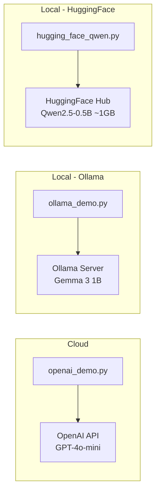

# Session 01 — LLM Setup & API Integration

> **Domain:** General AI / Platform · **Level:** Beginner · **Stack:** OpenAI, Ollama, HuggingFace Transformers

Three runnable scripts demonstrating how to integrate with three distinct LLM backends — cloud API, local inference, and open-weight model download — establishing the foundation for all subsequent sessions.

---

## Business Problem

Before building AI products, a TPM or engineer needs to understand the deployment spectrum: cloud-hosted APIs (fast, paid), local models via Ollama (private, free after setup), and raw HuggingFace model weights (maximum control, requires GPU). Each has different cost, latency, privacy, and compliance implications.

This session makes those trade-offs tangible with working code.

---

## What's Covered

| Script | Backend | Model | Use Case |
|--------|---------|-------|----------|
| `openai_demo.py` | OpenAI API (cloud) | GPT-4o-mini | Production-grade, pay-per-token |
| `ollama_demo.py` | Ollama (local) | Gemma 3 1B | Air-gapped / private deployments |
| `hugging_face_qwen.py` | HuggingFace Hub | Qwen2.5-0.5B | Open-weight, full model control |

---

## Architecture



---

## Prerequisites & Setup

```bash
cd ai-agent-bootcamp/session-01-llm-setup
python -m venv venv && source venv/bin/activate
pip install -r requirements.txt
cp ../../.env.example .env
# Edit .env: OPENAI_API_KEY=sk-...
```

**For Ollama (local):**
```bash
# Install Ollama: https://ollama.ai
ollama pull gemma3:1b
ollama serve  # starts on localhost:11434
```

**For HuggingFace Qwen:**
- Model downloads automatically on first run (~1 GB)
- Cached in `~/.cache/huggingface/`

---

## Running Each Demo

```bash
python openai_demo.py       # Cloud — requires OPENAI_API_KEY
python ollama_demo.py       # Local — requires Ollama running
python hugging_face_qwen.py # Local — downloads model on first run
```

---

## Key Takeaways

- **OpenAI API:** Lowest setup friction, highest quality, costs money, data leaves your environment
- **Ollama:** Zero latency overhead on local network, fully private, limited to smaller models
- **HuggingFace:** Maximum flexibility — swap any open-weight model, run fine-tuned adapters, no API dependency

---

## Run Tests

```bash
pytest tests/ -v
```
