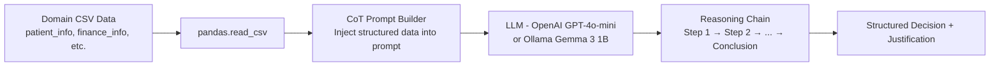

# Session 02 — Chain-of-Thought Reasoning (10 Industry Use Cases)

> **Domain:** Enterprise B2B / FinTech / HealthTech · **Level:** Intermediate · **Stack:** OpenAI, Ollama, Pandas

Ten production-style Chain-of-Thought (CoT) prompting examples across industries — each with both automated (LLM-generated reasoning chain) and manual (step-by-step explicit prompts) variants. All examples are data-driven, reading from accompanying CSV files.

---

## Business Problem

Most AI demos use toy examples. Real enterprise AI requires reasoning over structured business data — patient records, financial profiles, customer histories, supplier constraints. This session demonstrates how CoT prompting unlocks multi-step reasoning over tabular data without fine-tuning.

**TPM relevance:** Understanding CoT is essential for designing AI features that need to explain their recommendations to end users — a compliance requirement in healthcare, finance, and legal contexts.

---

## The 10 Use Cases

| # | Script | Domain | Business Problem |
|---|--------|--------|-----------------|
| 1 | `1.0.Example1-financial_Advisory_Automated_planning_cot.py` | FinTech | Automated investment plan generation with reasoning chain |
| 1b | `1.1.Example1-financial_advisory_manual.py` | FinTech | Same problem with manually-crafted step-by-step prompt |
| 2 | `2.0.Example2-Fraud_prediction_automated_COT.py` | FinTech | Transaction fraud scoring with audit trail |
| 2b | `2.1.Example2-Fraud_prediction_manual_COT.py` | FinTech | Manual CoT variant for fraud reasoning |
| 3 | `3.0.Example3-Ecommerce_recommender_system.py` | E-commerce | Personalised product recommendation with justification |
| 4 | `4.0.Example4-customer_service.py` | Enterprise B2B | Intent classification + response generation |
| 5 | `5.0.Example5-supply_chain.py` | Operations | Supplier selection reasoning under constraints |
| 6 | `6.0.Example6-Ed_tech.py` | EdTech | Personalised learning path generation |
| 7 | `7.0.Example7-Legal_document_analysis.py` | Legal/Compliance | Clause-by-clause contract analysis |
| 8 | `8.0.Example8-Health_care.py` | HealthTech | Diagnostic pathway reasoning from symptoms |
| 9 | `9.0.Example9-Personal_finance.py` | FinTech | Budget planning and savings advice |
| 10 | `10.0.Example10-technical_support.py` | Enterprise IT | Root-cause analysis for technical issues |

---

## Architecture



**Automated vs Manual CoT:**
- **Automated** (`*.._cot.py`): The LLM is prompted to generate its own reasoning steps — `"Think step by step"`
- **Manual** (`*..manual.py`): Each reasoning step is explicitly scripted in the prompt — maximum control, predictable structure

---

## Data Files

Each use case has dedicated CSV data files with realistic synthetic records:

| File | Used By |
|------|---------|
| `finance_info.csv`, `budget_constraints.csv` | Examples 1, 9 |
| `customer_data.csv`, `purchase_history.csv` | Examples 3, 4 |
| `patient_info.csv`, `symptom_analysis.csv`, `diagnostic_path.csv` | Example 8 |
| `contract_structure.csv`, `clause_analysis.csv`, `obligations.csv` | Example 7 |
| `supplier_info.csv`, `warehouse_constraints.csv` | Example 5 |
| `student_profile.csv`, `learning_history.csv` | Example 6 |

---

## Prerequisites & Setup

```bash
cd ai-agent-bootcamp/session-02-chain-of-thought
python -m venv venv && source venv/bin/activate
pip install -r requirements.txt
cp ../../.env.example .env
# Edit .env: OPENAI_API_KEY=sk-...
```

**For Ollama variant (`ollama_cot.py`):** Requires Ollama running locally with `gemma3:1b` pulled.

---

## Running Examples

```bash
# Run any individual example
python "1.0.Example1-financial_Advisory_Automated_planning_cot.py"
python "8.0.Example8-Health_care.py"

# Compare automated vs manual on financial advisory
python "1.0.Example1-financial_Advisory_Automated_planning_cot.py"
python "1.1.Example1-financial_advisory_manual.py"
```

---

## Key Takeaways

- Automated CoT is faster to implement but less predictable in structure
- Manual CoT gives you a consistent output schema — better for production pipelines
- Data-driven prompts (CSV injection) are the bridge between structured enterprise data and LLM reasoning
- CoT significantly improves accuracy on multi-step reasoning vs. direct-answer prompting

---

## Run Tests

```bash
pytest tests/ -v
```
