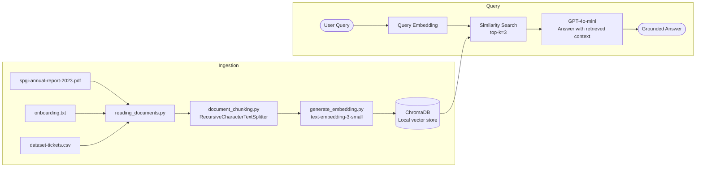

# Session 03 — RAG Fundamentals

> **Domain:** Enterprise B2B · **Level:** Intermediate · **Stack:** LangChain, ChromaDB, OpenAI, pypdf

Standalone pipeline scripts building a complete RAG system from scratch — document loading, chunking, embedding, vector storage, retrieval, and generation — with a multi-document variant and CSV-based RAG for structured data.

---

## Business Problem

Enterprise knowledge is distributed across PDFs, reports, and structured data files. Employees spend hours manually searching for answers. RAG converts any document corpus into a queryable knowledge base that returns grounded, cited answers — no hallucination, no expensive fine-tuning.

This session builds RAG from first principles, exposing each component as a separate, inspectable script — ideal for understanding what's happening inside frameworks like LangChain.

---

## Pipeline Scripts (run in order)

| Step | Script | What It Does |
|------|--------|-------------|
| 1 | `reading_documents.py` | Load PDF and TXT files into LangChain `Document` objects |
| 2 | `document_chunking.py` | Split documents into overlapping chunks (1,000 tokens, 200 overlap) |
| 3 | `generate_embedding.py` | Embed chunks using `text-embedding-3-small`, store in ChromaDB |
| 4 | `end_to_end_rag_part1.py` | Single-document RAG: retrieve top-k chunks → GPT-4o-mini answer |
| 5 | `end_to_end_rag_with_multiple_documents.py` | Multi-document RAG with metadata filtering |
| 6 | `rag_on_csv.py` | RAG over a multilingual support ticket CSV (4,000 rows) |

---

## Architecture



---

## Demo Data

| File | Description |
|------|-------------|
| `spgi-annual-report-2023.pdf` | S&P Global 2023 Annual Report (~150 pages) — financial Q&A |
| `onboarding.txt` | Employee onboarding document — HR Q&A |
| `dataset-tickets-multi-lang3-4k.csv` | 4,000 multilingual support tickets — structured RAG |

---

## Prerequisites & Setup

```bash
cd ai-agent-bootcamp/session-03-rag-fundamentals
python -m venv venv && source venv/bin/activate
pip install -r requirements.txt
cp ../../.env.example .env
# Edit .env: OPENAI_API_KEY=sk-...
```

---

## Running the Pipeline

```bash
# Full single-document pipeline
python reading_documents.py
python document_chunking.py
python generate_embedding.py
python end_to_end_rag_part1.py

# Multi-document RAG
python end_to_end_rag_with_multiple_documents.py

# RAG over CSV data
python rag_on_csv.py
```

---

## Key Concepts Demonstrated

- **Chunk size matters:** Too large = loses precision; too small = loses context. 1,000 tokens with 200 overlap is a solid default.
- **Embedding model choice:** `text-embedding-3-small` is 5x cheaper than `text-embedding-ada-002` with comparable quality.
- **ChromaDB persistence:** Vector store is saved to `.chroma_db/` — no re-embedding on subsequent runs.
- **Metadata filtering:** Multi-document RAG uses source metadata to scope retrieval to the right document.

---

## Run Tests

```bash
pytest tests/ -v
```
