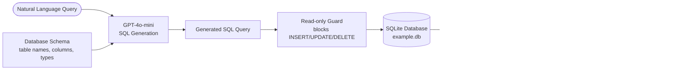

# Session 04 — Text-to-SQL

> **Domain:** Enterprise B2B · **Level:** Intermediate · **Stack:** OpenAI, LangChain, SQLite

Natural language to SQL query conversion over a SQLite database — enabling non-technical users to query structured data without knowing SQL. Includes a geolocation demo using the open-meteo API.

---

## Business Problem

Business analysts and operations teams spend significant time waiting for data engineers to write SQL queries. Text-to-SQL removes this bottleneck: users ask questions in plain English, the LLM generates the SQL, and results are returned instantly.

**Compliance note:** In enterprise environments, Text-to-SQL must be scoped to read-only queries with schema validation — preventing data mutation by malformed LLM output.

**Real-world application:** A sales operations manager asks *"Which customers placed more than 3 orders in the last 90 days?"* without writing a single line of SQL.

---

## Architecture



---

## Scripts

| Script | Purpose |
|--------|---------|
| `db_setup.py` | Creates `example.db` with sample tables and data — **run this first** |
| `txt2sql.py` | Main Text-to-SQL pipeline — accepts natural language, returns results |
| `get_lat_long.py` | Geolocation demo — converts a city name to lat/long via open-meteo (no API key) |

---

## Prerequisites & Setup

```bash
cd ai-agent-bootcamp/session-04-text-to-sql
python -m venv venv && source venv/bin/activate
pip install -r requirements.txt
cp ../../.env.example .env
# Edit .env: OPENAI_API_KEY=sk-...

# Create the database (required before running txt2sql.py)
python db_setup.py
```

---

## Running

```bash
# Text-to-SQL demo
python txt2sql.py
# When prompted, enter a question like:
# "How many customers are there?"
# "Show me all orders over $500"
# "What is the average order value?"

# Geolocation demo (no API key needed)
python get_lat_long.py
```

---

## Key Concepts Demonstrated

- **Schema injection:** The database schema is passed to the LLM as context — it never sees the data, only the structure
- **Read-only safety:** Guards prevent the LLM from generating destructive queries
- **LangChain SQL chain:** `SQLDatabaseChain` handles schema extraction, query generation, and result formatting
- **Free external API:** `get_lat_long.py` demonstrates integrating a no-auth REST API (open-meteo) for enrichment

---

## Sample Queries to Try

```
"List all customers from Ontario"
"What is the total revenue this month?"
"Which product category has the most orders?"
"Show the top 5 customers by order value"
```

---

## Run Tests

```bash
pytest tests/ -v
```
