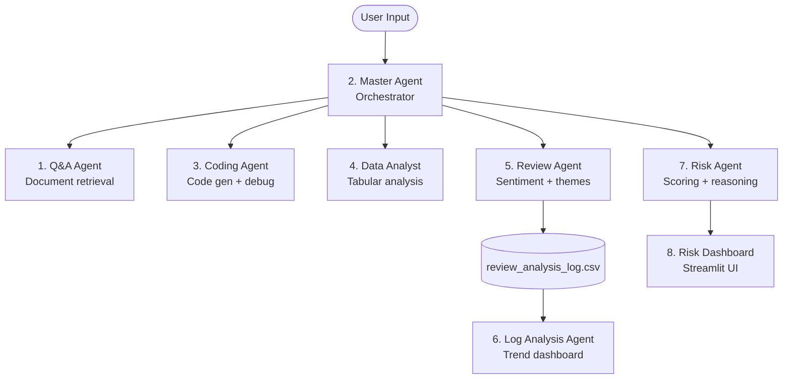

# Session 05 — Multi-Agent Orchestration

> **Domain:** Enterprise B2B / FinTech · **Level:** Advanced · **Stack:** LangChain, OpenAI, Streamlit

Eight specialised agents in one session — from a Q&A chatbot to a risk assessment engine — demonstrating how to decompose complex business workflows into focused, composable agents with Streamlit UIs.

---

## Business Problem

Single-agent systems break down under complexity. A customer support platform needs agents specialised for intent classification, knowledge retrieval, escalation routing, and sentiment monitoring — not one agent trying to do everything. This session shows how to build and orchestrate specialised agents that each own a specific capability.

---

## The 8 Agents

| # | Script | Capability | Interface |
|---|--------|-----------|-----------|
| 1 | `1.qna_chatbot_UI.py` | Document Q&A with conversational memory | Streamlit |
| 2 | `2.master_agent_ui.py` | Orchestrator that delegates to specialised sub-agents | Streamlit |
| 3 | `3.coding_agent.py` | Code generation, explanation, and debugging | CLI |
| 4 | `4.data_analyst_agent.py` | Tabular data analysis — describe, query, visualise | CLI |
| 5 | `5.hotel_review_analysis.py` | Sentiment + theme extraction from hotel reviews | CLI (generates log) |
| 6 | `6.hotel_review_log_analysis.py` | Trend analysis over the review log from Agent 5 | Streamlit |
| 7 | `7.risk_assessment.py` | Financial/operational risk scoring with reasoning | CLI |
| 8 | `8.risk_assessment_streamlit_ui.py` | Risk assessment with interactive dashboard | Streamlit |

> **Note:** Run Agent 5 before Agent 6 — Agent 6 reads the log file generated by Agent 5.

---

## Architecture



---

## Prerequisites & Setup

```bash
cd ai-agent-bootcamp/session-05-multi-agent-orchestration
python -m venv venv && source venv/bin/activate
pip install -r requirements.txt
cp ../../.env.example .env
# Edit .env: OPENAI_API_KEY=sk-...
```

---

## Running

```bash
# Streamlit apps
streamlit run 1.qna_chatbot_UI.py
streamlit run 2.master_agent_ui.py
streamlit run 8.risk_assessment_streamlit_ui.py

# CLI agents (run in order for 5→6)
python 5.hotel_review_analysis.py    # generates review_analysis_log.csv
streamlit run 6.hotel_review_log_analysis.py  # reads the log

# Individual CLI agents
python 3.coding_agent.py
python 4.data_analyst_agent.py
python 7.risk_assessment.py
```

---

## Key Concepts Demonstrated

- **Master agent pattern:** A single orchestrator delegates to specialised tools — analogous to a manager routing tasks to subject-matter experts
- **Sequential pipeline:** Agent 5 → Agent 6 shows how agents can produce artefacts consumed by downstream agents
- **Tool binding:** `data_analyst_agent.py` demonstrates binding custom Python functions as LangChain tools
- **Stateful chat:** Agent 1 maintains conversation memory across turns using `ConversationBufferMemory`

---

## Run Tests

```bash
pytest tests/ -v
```
