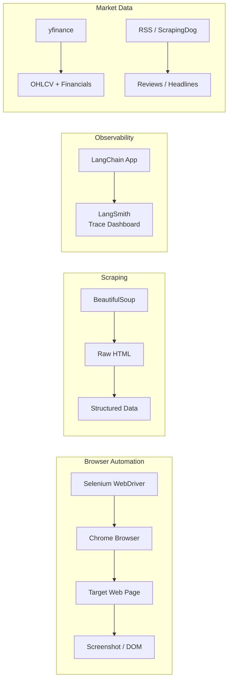

# Session 06 — Browser Automation & Web Scraping

> **Domain:** General AI / Platform · **Level:** Advanced · **Stack:** Selenium, BeautifulSoup, LangSmith, yfinance

Twelve scripts covering the full web automation spectrum — from programmatic browser control and login flows to news scraping, stock data retrieval, and LLM observability with LangSmith.

---

## Business Problem

Competitive intelligence, market monitoring, and data enrichment pipelines all require pulling information from the web at scale. Manual browsing is not scalable. This session covers the tools and patterns that power real-world AI data pipelines — from scraping to LLM tracing.

**TPM relevance:** Understanding web automation helps scope AI features that depend on live external data — knowing what's automatable, what's restricted by ToS, and how to instrument observability into LLM pipelines.

---

## The 12 Scripts

| # | Script | Capability | Requires |
|---|--------|-----------|---------|
| 1 | `1.langsmith_demo.py` | Trace LangChain calls with LangSmith observability | `LANGSMITH_API_KEY` |
| 2 | `2.open_browser.py` | Selenium: programmatically open a browser | ChromeDriver |
| 3 | `3.google_search_demo.py` | Automate a Google search and capture results | ChromeDriver |
| 4 | `4.google_news_article_scrape.py` | Scrape Google News headlines with BeautifulSoup | requests |
| 5 | `5.screenshot.py` | Capture full-page screenshots with Selenium | ChromeDriver |
| 6 | `6.login_demo.py` | Automate a login flow (saucedemo.com) | ChromeDriver |
| 7 | `7.login_demo_error.py` | Capture a failed login + screenshot error state | ChromeDriver |
| 8 | `8.analyse_login_error_image.py` | GPT-4o vision analysis of login error screenshot | `OPENAI_API_KEY` + screenshot from Script 7 |
| 9 | `9.bbc_news_scraper.py` | Scrape BBC News headlines and summaries | requests, BeautifulSoup |
| 10 | `10.yahoo_feed_parsing.py` | Parse Yahoo Finance RSS feed | feedparser |
| 11 | `11.reading_stock_data_yfinance.py` | Pull live stock OHLCV data via yfinance | yfinance (no key) |
| 12 | `12.amazon_review_scraper.py` | Scrape Amazon product reviews via ScrapingDog API | `SCRAPINGDOG_API_KEY` |

---

## Architecture



---

## Prerequisites & Setup

```bash
cd ai-agent-bootcamp/session-06-browser-automation
python -m venv venv && source venv/bin/activate
pip install -r requirements.txt
cp ../../.env.example .env
# Edit .env with relevant keys (see below)
```

**ChromeDriver (for Selenium scripts 2–8):**
```bash
# webdriver-manager handles this automatically:
# from selenium import webdriver
# from webdriver_manager.chrome import ChromeDriverManager
# driver = webdriver.Chrome(ChromeDriverManager().install())
```

**API keys needed:**

| Key | Scripts | Where to Get |
|-----|---------|-------------|
| `OPENAI_API_KEY` | Script 8 | platform.openai.com |
| `LANGSMITH_API_KEY` | Script 1 | smith.langchain.com |
| `SCRAPINGDOG_API_KEY` | Script 12 | scrapingdog.com |

Scripts 9, 10, 11 require no API keys.

---

## Running Order for Dependent Scripts

```bash
# Scripts 7 → 8 are sequential (7 generates screenshot, 8 analyses it)
python 7.login_demo_error.py      # generates login_error.png
python 8.analyse_login_error_image.py  # analyses the screenshot

# All others are independent
python 11.reading_stock_data_yfinance.py  # no setup needed
python 9.bbc_news_scraper.py              # no setup needed
python 10.yahoo_feed_parsing.py           # no setup needed
```

---

## Key Concepts Demonstrated

- **WebDriver Manager:** Auto-downloads matching ChromeDriver version — no manual binary management
- **LangSmith tracing:** Every LLM call gets a trace ID, latency, token count, and prompt/response logged to the dashboard
- **GPT-4o Vision:** Script 8 shows how to send a base64-encoded screenshot to the OpenAI vision API
- **No-auth data sources:** yfinance and RSS feeds show how to build market data pipelines with zero API cost

---

## Run Tests

```bash
pytest tests/ -v
```
