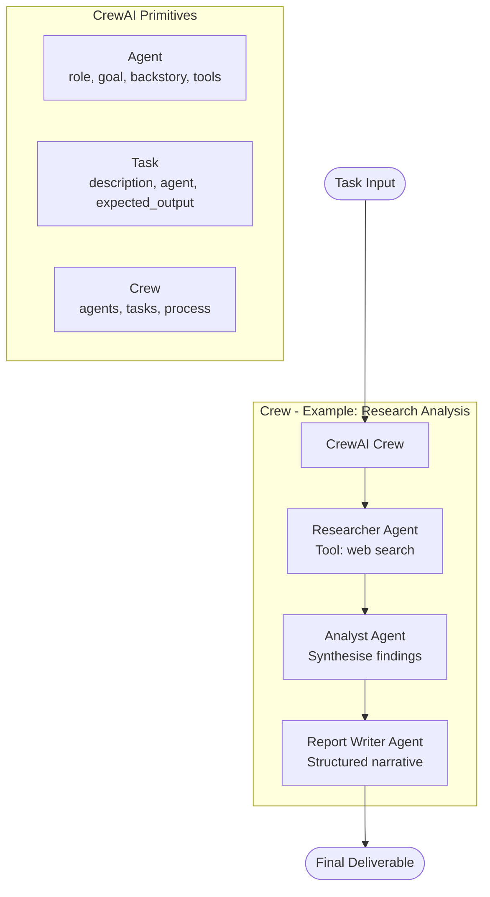

# Session 07 — CrewAI Multi-Agent Systems

> **Domain:** Enterprise B2B · **Level:** Advanced · **Stack:** CrewAI, OpenAI, LangChain

Role-based multi-agent crews that collaborate to complete complex, multi-step tasks — from research and analysis to structured debate and customer support — using CrewAI's agent/task/crew abstraction.

---

## Business Problem

Single agents hit a ceiling on complex tasks requiring different expertise at different stages. A market research report needs a researcher (broad retrieval), an analyst (synthesis and critique), and a writer (narrative output) — three different roles, each requiring different prompting and tooling. CrewAI formalises this pattern.

**TPM relevance:** CrewAI's role/task/crew model maps directly to how product teams work — breaking a deliverable into parallel workstreams with defined handoffs. Understanding it enables you to design multi-step AI workflows with clear accountability.

---

## The 6 Crews

| # | Script | Crew Composition | Output |
|---|--------|-----------------|--------|
| 1 | `1.edtech_demo.py` | Curriculum Designer + Content Writer + Reviewer | Personalised learning plan |
| 2 | `2.customer_support_demo.py` | Intake Agent + Knowledge Agent + Resolution Agent | Support ticket resolution |
| 3 | `3.research_analysis.py` | Researcher + Analyst + Report Writer | Structured research brief |
| 4 | `4.print_media.py` | Editor + Journalist + Fact Checker | News article draft |
| 5 | `5.tool_usage_crewai.py` | Agent with bound tools (search, calculator, web) | Tool-augmented task output |
| 6 | `6.multi_debate_system.py` | Advocate + Devil's Advocate + Moderator | Structured multi-perspective debate |

---

## Architecture



**CrewAI Process types used:**
- `Process.sequential` — agents work in order (researcher → analyst → writer)
- `Process.hierarchical` — manager agent delegates to sub-agents

---

## Prerequisites & Setup

```bash
cd ai-agent-bootcamp/session-07-crewai-agents
python -m venv venv && source venv/bin/activate
pip install -r requirements.txt
cp ../../.env.example .env
# Edit .env: OPENAI_API_KEY=sk-...
```

---

## Running

```bash
# Each script is self-contained
python 1.edtech_demo.py
python 2.customer_support_demo.py
python 3.research_analysis.py
python 4.print_media.py
python 5.tool_usage_crewai.py

# Multi-perspective debate (Streamlit UI)
streamlit run 6.multi_debate_system.py
```

---

## Key Concepts Demonstrated

- **Agent specialisation:** Each agent has a `role`, `goal`, and `backstory` — this context shapes its reasoning style
- **Task chaining:** Task outputs become inputs for the next agent — explicit handoff contracts
- **Tool binding in CrewAI:** Script 5 shows how to bind Python functions and search tools to specific agents
- **Debate as validation:** Script 6's advocate/devil's advocate pattern is a practical technique for stress-testing AI recommendations before presenting to stakeholders

---

## Run Tests

```bash
pytest tests/ -v
```
