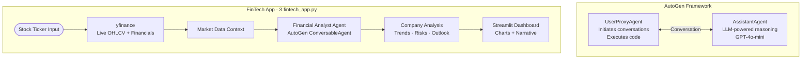

# Session 08 — AutoGen FinTech App

> **Domain:** FinTech · **Level:** Advanced · **Stack:** AutoGen (AG2), OpenAI, yfinance, Streamlit

Conversational financial analysis powered by AutoGen's multi-agent conversation framework — live market data via yfinance, agent-driven analysis, and an interactive Streamlit dashboard.

---

## Business Problem

Financial analysts spend hours pulling data from multiple sources, running calculations, and writing summaries before they can answer a single investment question. An AutoGen-powered agent can pull live data, run analysis, and return a structured briefing in under a minute — accessible to non-technical stakeholders through a plain-English interface.

**TPM relevance:** AutoGen's `ConversableAgent` pattern — where agents initiate, respond, and terminate conversations programmatically — is the foundation of autonomous AI workflows. Understanding it is essential for designing AI features that operate without a human in the loop.

---

## The 3 Scripts

| Script | What It Builds | Interface |
|--------|---------------|-----------|
| `1.autogen_demo.py` | Two-agent conversation: UserProxy ↔ AssistantAgent — baseline AutoGen pattern | CLI |
| `2.autogen_demo2.py` | Extended conversation with custom termination conditions and agent personas | CLI |
| `3.fintech_app.py` | Full FinTech app: live stock data + financial analysis agent + Streamlit UI | Streamlit |

---

## Architecture



**AutoGen key concepts:**
- `UserProxyAgent` — represents the human; can execute code returned by the assistant
- `AssistantAgent` — LLM-backed; generates responses, can write Python code
- `initiate_chat()` — starts the conversation; agents exchange messages until a termination condition is met
- `max_consecutive_auto_reply` — safety limit on autonomous back-and-forth

---

## Prerequisites & Setup

```bash
cd ai-agent-bootcamp/session-08-autogen-fintech
python -m venv venv && source venv/bin/activate
pip install -r requirements.txt
cp ../../.env.example .env
# Edit .env: OPENAI_API_KEY=sk-...
```

> **Dependency note:** This project uses `pyautogen==0.10.0` (Microsoft AG2 fork). Do not install the separate `autogen` package — they conflict.

---

## Running

```bash
# Basic AutoGen two-agent demo
python 1.autogen_demo.py

# Extended conversation demo
python 2.autogen_demo2.py

# FinTech Streamlit app
streamlit run 3.fintech_app.py
# Enter a ticker (e.g. AAPL, MSFT, NVDA) and ask questions like:
# "What is the revenue trend over the past 3 years?"
# "What are the key risks for this stock?"
# "Compare the P/E ratio to the sector average"
```

---

## Evaluation & Metrics

| Metric | Observation |
|--------|-------------|
| Data freshness | yfinance pulls live data — always current |
| Analysis latency | ~5–15 seconds per query (API + agent conversation) |
| Code execution | UserProxy can execute Python code blocks returned by the assistant |
| Conversation depth | Configurable via `max_consecutive_auto_reply` — default 5 turns |

---

## Guardrails

- `os.environ['OPENAI_API_KEY']` validated at startup — raises `ValueError` with clear message if missing
- yfinance exceptions handled with fallback messages — app doesn't crash on invalid tickers
- `max_consecutive_auto_reply=5` prevents runaway agent loops
- Code execution in UserProxy is sandboxed to the working directory

---

## Future Enhancements

- [ ] Add portfolio analysis — compare multiple tickers simultaneously
- [ ] Integrate news sentiment via RSS or a news API for qualitative context
- [ ] Add a financial report export (PDF) from the Streamlit app
- [ ] Swap GPT-4o-mini for a local Ollama model for zero-cost inference

---

## Run Tests

```bash
pytest tests/ -v
```
