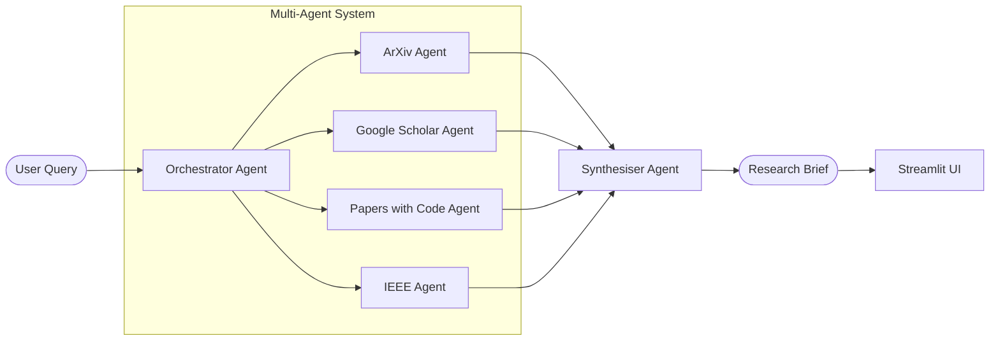

# 01 — Autogen Research Assistant

> **Domain:** General AI · **Level:** Beginner · **Stack:** AutoGen, Groq (LLaMA 3), Streamlit

A multi-agent research pipeline that autonomously retrieves and synthesises academic papers from ArXiv, Google Scholar, Papers with Code, and IEEE — producing a structured research brief from a single natural-language query.

---

## Business Problem

Research professionals and product teams spend hours manually searching across databases, reading abstracts, and synthesising findings before they can make informed technology decisions. This agent automates that discovery workflow: one query, multiple specialised agents, one consolidated report.

**Real-world application:** A TPM evaluating whether to adopt a new AI framework can get a 5-paper synthesis in under 2 minutes instead of spending half a day on Google Scholar.

---

## Architecture



**Flow:**
1. User submits a research query via Streamlit
2. Orchestrator agent delegates to four specialised retrieval agents in parallel
3. Each agent queries its assigned source and returns top results
4. Synthesiser agent combines findings into a structured brief (Problem → Methods → Results → Recommendations)

---

## Technical Stack

| Component | Technology |
|-----------|-----------|
| Agent Framework | AutoGen (Microsoft AG2) |
| LLM Backend | Groq API — LLaMA 3.1 70B |
| Data Sources | ArXiv API, Google Scholar (via requests), Papers with Code API |
| UI | Streamlit |
| Config | python-dotenv |

---

## Prerequisites & Setup

```bash
# 1. Clone and navigate
cd ai-gen-bootcamp/01-autogen-research-agent

# 2. Create virtual environment
python -m venv venv && source venv/bin/activate  # Windows: venv\Scripts\activate

# 3. Install dependencies
pip install -r requirements.txt

# 4. Configure API key
cp ../../.env.example .env
# Edit .env and set: GROQ_API_KEY=gsk_...

# 5. Run
streamlit run app.py
```

**Get a Groq API key (free):** https://console.groq.com

---

## How to Use

1. Open the Streamlit app at `http://localhost:8501`
2. Enter a research topic — e.g. *"retrieval-augmented generation for enterprise knowledge bases"*
3. Click **Research** — agents run in parallel (~30–60 seconds)
4. Review the structured brief with paper titles, abstracts, and links

---

## Evaluation & Metrics

| Metric | Observation |
|--------|-------------|
| Query-to-brief latency | 30–60 seconds (Groq LPU inference) |
| Papers retrieved per source | 3–5 per agent |
| Output quality | Structured sections: Background, Key Methods, Results, Recommendations |

---

## Guardrails

- API rate limiting: requests include backoff logic to avoid ArXiv/Scholar throttling
- Groq API key validated at startup — clear error message if missing
- Agent outputs are summarised, not hallucinated: all claims are grounded in retrieved abstracts

---

## Future Enhancements

- [ ] Add citation export (BibTeX / Zotero)
- [ ] Support domain filtering (e.g. "only HealthTech papers from 2023–2025")
- [ ] Persist research briefs to a local SQLite database
- [ ] Add a semantic similarity score to surface the most relevant papers first

---

## Run Tests

```bash
pytest tests/ -v
```
