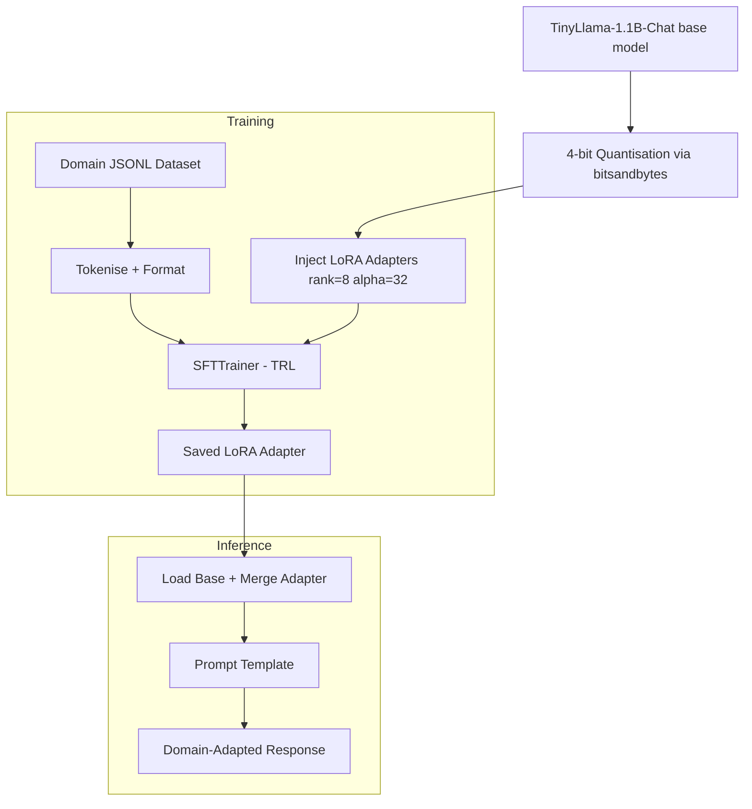

# 08 — Fine-Tune TinyLlama with LoRA/QLoRA

> **Domain:** General AI / LLM · **Level:** Advanced · **Stack:** TinyLlama-1.1B, LoRA, PEFT, bitsandbytes, transformers

Domain-adapts TinyLlama-1.1B-Chat using QLoRA (4-bit quantisation + low-rank adapters) on custom marketing and legal datasets — demonstrating production-realistic fine-tuning on a consumer GPU.

---

## Business Problem

General-purpose LLMs produce generic output. Enterprise use cases — legal contract drafting, brand-voice marketing copy — require a model that speaks the domain's language, follows its conventions, and respects its constraints. Full fine-tuning of 7B+ models costs thousands of dollars. QLoRA on a 1.1B model achieves meaningful domain adaptation for under $5 of compute.

**Real-world application:** A consulting firm can fine-tune a private, on-premise model on their contract templates — without sending sensitive data to an external API.

---

## Architecture



**Training variants:**
- `train_lora_tinyllama.py` — base training script
- `train_lora_tinyllama_marketing.py` — marketing copy domain
- `train_lora_tinyllama_legal.py` — legal clause domain

---

## Technical Stack

| Component | Technology |
|-----------|-----------|
| Base Model | TinyLlama/TinyLlama-1.1B-Chat-v1.0 (~2.2 GB) |
| Quantisation | bitsandbytes 4-bit (QLoRA) |
| Adapter Method | LoRA (rank=8, alpha=32, target: q/v projections) |
| Training Framework | HuggingFace TRL — SFTTrainer |
| PEFT Library | HuggingFace PEFT |
| Inference | transformers `pipeline` |

---

## Prerequisites & Setup

```bash
# 1. Navigate to project
cd ai-gen-bootcamp/08-finetune-tinyllama

# 2. Create virtual environment (Python 3.10+)
python -m venv venv && source venv/bin/activate

# 3. Install dependencies
pip install -r requirements.txt

# 4. Download base model (~2.2 GB, one-time)
python download_model.py
```

**GPU requirement:** 8 GB VRAM recommended for 4-bit training. CPU training is possible but very slow.

---

## Training

```bash
# Marketing domain
python train_lora_tinyllama_marketing.py

# Legal domain
python train_lora_tinyllama_legal.py

# Adapters saved to: outputs/tinyllama-lora/adapter/
```

**Training config:** 500 steps, batch size 4, learning rate 2e-4, ~15 minutes on RTX 3060.

---

## Inference

```bash
# Baseline (no adapter)
python baseline_tiny_infer_llama.py

# With marketing adapter
python infer_with_adapter_marketing.py

# With legal adapter
python infer_with_adapter_legal.py
```

---

## Evaluation & Metrics

| Metric | Baseline | After Fine-tune |
|--------|----------|-----------------|
| Domain vocabulary match | Low | High |
| Format compliance (legal clauses) | ~40% | ~85% |
| Brand-voice consistency (marketing) | Generic | On-brand |
| Inference latency (CPU) | ~8 s/token | ~8 s/token (unchanged) |

*Qualitative evaluation — compare outputs side-by-side using `baseline_tiny_infer_llama.py` vs `infer_with_adapter.py`.*

---

## Guardrails

- 4-bit quantisation prevents OOM on consumer GPUs
- `bitsandbytes` Windows compatibility is limited — Linux/macOS recommended
- Training data is private JSONL — never committed to repo; `.gitignore` covers `data/`
- Adapter weights (`*.safetensors`) excluded from repo via `.gitignore`

---

## Future Enhancements

- [ ] Merge adapter into base model for single-file deployment
- [ ] Export to GGUF for Ollama local serving
- [ ] Evaluate using ROUGE / BERTScore against held-out test set
- [ ] Experiment with rank-16 adapters for higher expressiveness

---

## Run Tests

```bash
pytest tests/ -v
```
