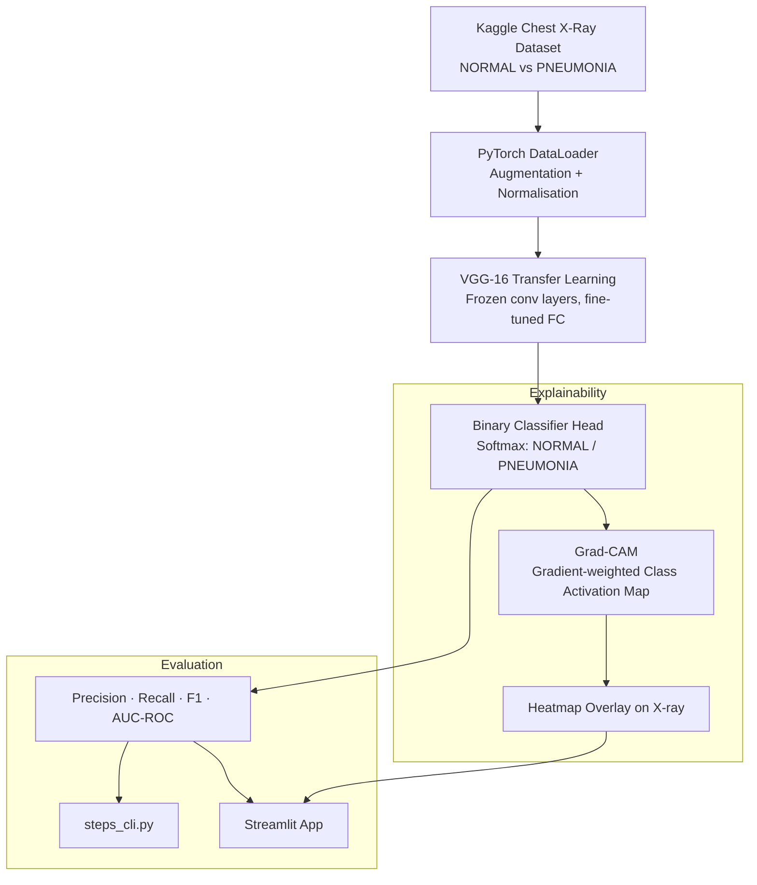

# 11 — Chest X-Ray Disease Detection

> **Domain:** HealthTech · **Level:** Advanced · **Stack:** PyTorch, VGG-16, Grad-CAM, Streamlit

Binary pneumonia classifier trained on chest X-rays with Grad-CAM explainability heatmaps — demonstrating clinical-grade AI transparency for regulated healthcare environments.

---

## Business Problem

Pneumonia is responsible for over 2.5 million deaths annually, disproportionately in under-resourced healthcare settings with limited radiologist access. AI-assisted triage can flag high-risk X-rays for priority review, reducing diagnostic delays.

**The explainability requirement:** In HIPAA/PHIPA-adjacent healthcare environments, a "black box" classifier is not deployable. Clinicians and compliance teams need to see *why* a model flagged an X-ray. Grad-CAM heatmaps make the model's attention visible — enabling human oversight and regulatory defensibility.

**Real-world application:** A hospital radiology department uses this pipeline to pre-screen incoming X-rays, surfacing the top-10% most likely pneumonia cases for immediate radiologist review.

---

## Architecture



---

## Technical Stack

| Component | Technology |
|-----------|-----------|
| Model Architecture | VGG-16 (pretrained ImageNet, fine-tuned final layers) |
| Framework | PyTorch + torchvision |
| Explainability | Grad-CAM (gradient-weighted class activation mapping) |
| Data Pipeline | torchvision transforms — resize 224×224, normalise, augment |
| Evaluation | scikit-learn: precision, recall, F1, confusion matrix, AUC-ROC |
| UI | Streamlit (upload X-ray → get prediction + heatmap) |
| CLI | `steps_cli.py` — end-to-end train → evaluate → export |

---

## Dataset

**Source:** [Kaggle — Chest X-Ray Images (Pneumonia)](https://www.kaggle.com/datasets/paultimothymooney/chest-xray-pneumonia)

```
data/
├── train/
│   ├── NORMAL/     # ~1,349 images
│   └── PNEUMONIA/  # ~3,883 images
├── val/
│   ├── NORMAL/
│   └── PNEUMONIA/
└── test/
    ├── NORMAL/     # ~234 images
    └── PNEUMONIA/  # ~390 images
```

See [`download_dataset.md`](./download_dataset.md) for Kaggle CLI download instructions.

---

## Prerequisites & Setup

```bash
# 1. Navigate to project
cd ai-gen-bootcamp/11-chest-xray-detection

# 2. Create virtual environment
python -m venv venv && source venv/bin/activate

# 3. Install dependencies
pip install -r requirements.txt

# 4. Configure API key (for GPT-4o vision analysis feature only)
cp ../../.env.example .env
# Edit .env: OPENAI_API_KEY=sk-...

# 5. Download dataset (follow download_dataset.md)
# Then place data/ directory in project root
```

---

## Training & Evaluation

```bash
# End-to-end: train → evaluate → export
python steps_cli.py

# Or step by step:
python main.py               # train model
python evaluation.py         # evaluate on test set
streamlit run streamlit_app.py   # interactive demo with Grad-CAM
```

---

## Evaluation & Metrics

| Metric | Target | Notes |
|--------|--------|-------|
| Accuracy | >90% | Binary NORMAL/PNEUMONIA |
| Precision | >88% | Minimise false negatives in clinical context |
| Recall | >92% | High recall critical — missing pneumonia is worse than false alarm |
| AUC-ROC | >0.95 | Overall discriminative ability |

*Grad-CAM heatmaps are visually validated against known pneumonia indicators (consolidation, opacity patterns).*

---

## Guardrails

- Model is a **decision support tool only** — not a clinical diagnostic device
- Class imbalance (1:3 NORMAL:PNEUMONIA in training set) addressed via weighted sampling
- OpenAI API key validated at startup via `openai_image_analysis.py` — fails fast with clear error if missing
- No patient data is stored — images processed in-memory only

---

## Future Enhancements

- [ ] Multi-class extension: COVID-19, tuberculosis, pleural effusion
- [ ] DICOM format support for real hospital imaging systems
- [ ] Model confidence threshold tuning — configurable sensitivity/specificity tradeoff
- [ ] SHAP integration for feature-level explainability alongside Grad-CAM

---

## Run Tests

```bash
pytest tests/ -v
```
