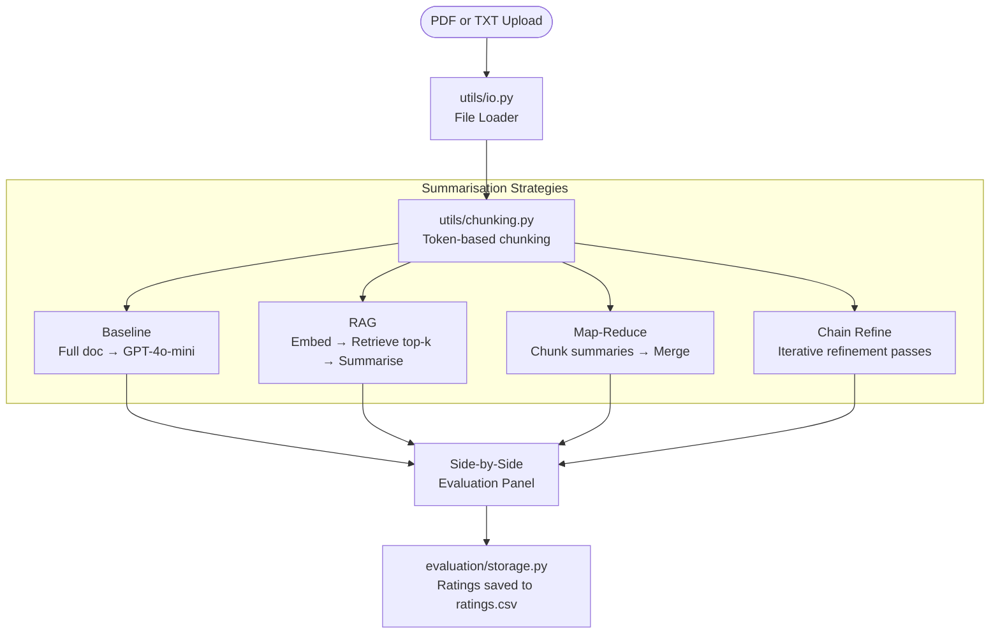

# 13 — Legal Document Summarizer

> **Domain:** Enterprise B2B · **Level:** Intermediate · **Stack:** OpenAI GPT-4o-mini, LangChain, RAG, Streamlit

Multi-strategy document summarisation platform comparing four NLP approaches — baseline, RAG, map-reduce, and chain-refine — with a side-by-side evaluation panel for real-world legal and enterprise documents.

---

## Business Problem

Legal teams, compliance officers, and enterprise consultants regularly process 50–300 page documents (contracts, due diligence packages, regulatory filings) under time pressure. A single summarisation approach doesn't fit all cases — a 5-page NDA needs different handling than a 300-page M&A agreement with 40 annexures.

**The gap:** Most AI summarisation tools offer one strategy and hide their reasoning. This platform exposes four strategies, lets users compare outputs side-by-side, and teaches users when to use each approach.

**Real-world application:** M&A due diligence — a financial analyst uploads a merger agreement and uses RAG to extract specific indemnity clauses, while map-reduce produces an executive summary of all schedules.

---

## Architecture



**Strategy guide:**

| Strategy | Best For | Limitation |
|----------|----------|------------|
| Baseline | Short docs (<10 pages) | Loses detail on long docs |
| RAG | Targeted clause extraction | Needs a specific query |
| Map-Reduce | Very long docs (>100 pages) | May lose cross-chunk context |
| Chain Refine | Executive briefs | Slower — sequential passes |

---

## Technical Stack

| Component | Technology |
|-----------|-----------|
| LLM | OpenAI GPT-4o-mini |
| Orchestration | LangChain |
| Embeddings | `text-embedding-3-small` (OpenAI) |
| Vector Store | FAISS (in-memory) |
| File Parsing | pypdf, plain text |
| Chunking | Token-based (`tiktoken`) |
| UI | Streamlit |
| Evaluation Storage | CSV via pandas |

---

## Prerequisites & Setup

```bash
# 1. Navigate to project
cd ai-gen-bootcamp/13-legal-doc-summarizer

# 2. Create virtual environment
python -m venv venv && source venv/bin/activate

# 3. Install dependencies
pip install -r requirements.txt

# 4. Configure API key
cp ../../.env.example .env
# Edit .env: OPENAI_API_KEY=sk-...

# 5. Run
streamlit run app.py
```

---

## How to Use

1. Open the Streamlit app at `http://localhost:8501`
2. Upload a PDF or paste text (try a contract, research paper, or annual report)
3. (For RAG) Enter a specific query: *"What are the termination clauses?"*
4. Click each strategy to generate its summary
5. Rate each output (1–5) in the evaluation panel — ratings are saved for analysis

---

## Evaluation & Metrics

| Metric | Method |
|--------|--------|
| Subjective quality | User ratings (1–5) collected in `ratings.csv` |
| Factual grounding | RAG cites source chunks; baseline is un-grounded |
| Latency | Baseline < RAG < Chain Refine < Map-Reduce (for long docs) |
| Coverage | Map-Reduce captures the full document; RAG focuses on query-relevant sections |

---

## Guardrails

- All API calls use `gpt-4o-mini` — cost-controlled (~$0.01 per 50-page document)
- No document content is stored beyond the session — files processed in memory only
- OpenAI API key validated on startup — fails fast with clear error message
- Chunking respects token limits — no requests exceed 128k context window

---

## Future Enhancements

- [ ] Add ROUGE / BERTScore automated evaluation against reference summaries
- [ ] Support `.docx` and `.xlsx` input formats
- [ ] Persistent document library with vector store caching
- [ ] Export summaries to PDF or Word with source citations

---

## Run Tests

```bash
pytest tests/ -v
```
