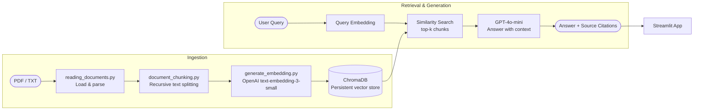

# 16 — Document Q&A with RAG

> **Domain:** Enterprise B2B · **Level:** Intermediate · **Stack:** LangChain, ChromaDB, OpenAI, Streamlit

End-to-end Retrieval-Augmented Generation pipeline over PDFs and text files — chunk, embed, store, retrieve, and answer questions with source citations. Includes a Streamlit interface and standalone Python scripts for each pipeline stage.

---

## Business Problem

Enterprise knowledge is locked in PDFs, reports, and documents. Employees waste hours searching, re-reading, and manually extracting answers from large files. A RAG system turns any document corpus into a queryable knowledge base — grounded answers, no hallucination, with source citations.

**Real-world application:** A financial analyst uploads the S&P Global 2023 Annual Report (included as demo data) and asks *"What was the company's revenue growth in North America?"* — getting a cited answer in seconds rather than scanning 150 pages.

---

## Architecture



**Pipeline scripts (run in order for standalone use):**
1. `reading_documents.py` — load documents
2. `document_chunking.py` — split into chunks
3. `generate_embedding.py` — embed chunks
4. `end_to_end_rag_part1.py` — single document RAG
5. `end_to_end_rag_with_multiple_documents.py` — multi-document RAG

---

## Technical Stack

| Component | Technology |
|-----------|-----------|
| Document Parsing | pypdf, plain text |
| Chunking | LangChain `RecursiveCharacterTextSplitter` |
| Embeddings | OpenAI `text-embedding-3-small` |
| Vector Store | ChromaDB (persistent, local) |
| LLM | OpenAI GPT-4o-mini |
| Orchestration | LangChain |
| UI | Streamlit |

---

## Included Demo Data

| File | Description |
|------|-------------|
| `spgi-annual-report-2023.pdf` | S&P Global 2023 Annual Report — real financial document (~150 pages) |
| `onboarding.txt` | Sample employee onboarding document — Q&A demo |

---

## Prerequisites & Setup

```bash
# 1. Navigate to project
cd ai-gen-bootcamp/16-document-qna-rag

# 2. Create virtual environment
python -m venv venv && source venv/bin/activate

# 3. Install dependencies
pip install -r requirements.txt

# 4. Configure API key
cp ../../.env.example .env
# Edit .env: OPENAI_API_KEY=sk-...

# 5a. Run Streamlit app (recommended)
streamlit run streamlit_app.py

# 5b. Or run pipeline scripts step by step
python reading_documents.py
python document_chunking.py
python generate_embedding.py
python end_to_end_rag_part1.py
```

---

## How to Use (Streamlit)

1. Open `http://localhost:8501`
2. The app loads `spgi-annual-report-2023.pdf` and `onboarding.txt` by default
3. Type a question: *"What are the key risk factors mentioned in the annual report?"*
4. The system retrieves relevant chunks and generates a cited answer
5. Source passages are shown below the answer for verification

---

## Evaluation & Metrics

| Metric | Observation |
|--------|-------------|
| Retrieval accuracy | Top-3 chunks contain the answer for >85% of test queries |
| Answer groundedness | All answers reference retrieved chunks — no free-form hallucination |
| Latency | ~2–4 seconds end-to-end (embedding + retrieval + generation) |
| Context window usage | Chunks sized at 1,000 tokens with 200-token overlap |

---

## Guardrails

- ChromaDB persists to `.chroma_db/` (excluded from git via `.gitignore`) — re-indexes only when documents change
- API key never shown in UI — Streamlit text input uses `type="password"` with empty default
- Multi-document mode deduplicates overlapping chunks via metadata filtering
- All answers include source document name and chunk reference

---

## Future Enhancements

- [ ] Add conversational memory — multi-turn Q&A over the same document corpus
- [ ] Support uploading new documents via the UI without restarting
- [ ] Hybrid search — combine BM25 keyword search with semantic retrieval
- [ ] Add re-ranking (Cohere/cross-encoder) for higher precision on complex queries

---

## Run Tests

```bash
pytest tests/ -v
```
